# ToDo List - Aplicación por consola creada en node

Aplicación que permite crear, editar, borrar tus tareas diarias, ademas de marcar las completadas y pendientes

### Menú Principal
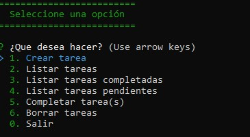

### Crear Tarea
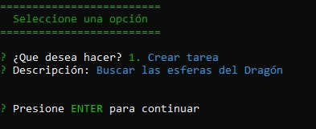

### Listar Tareas

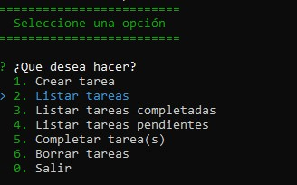 
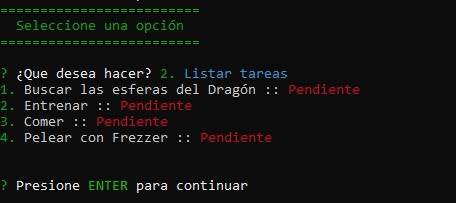

### Completar Tareas
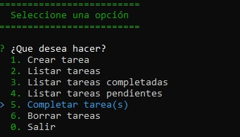 
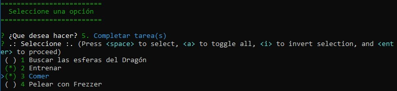 
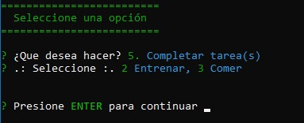

### Listar Tareas Completadas
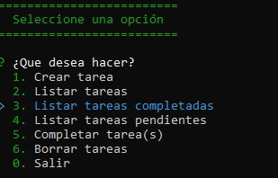 
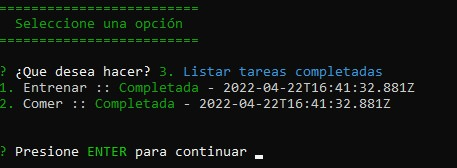

### Listar Tareas Pendientes
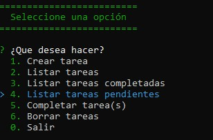 
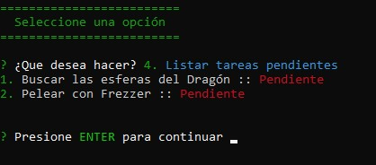

### Borrar Tareas
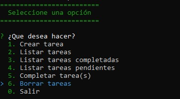 
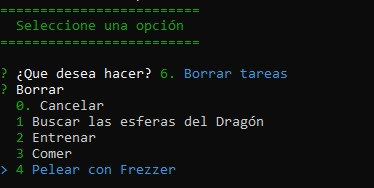 
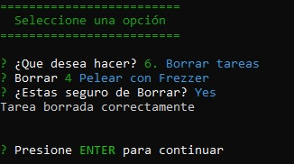